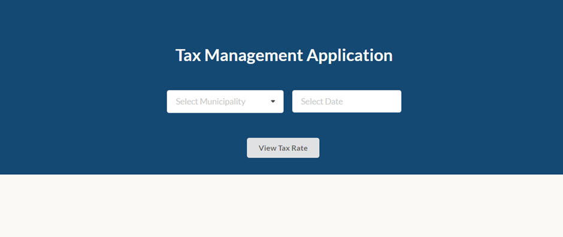
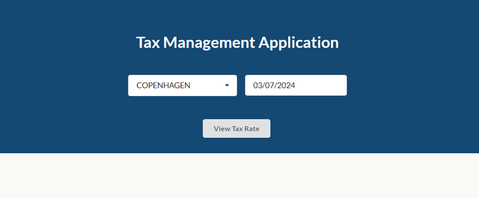
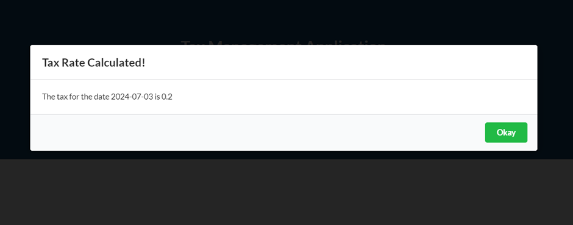

# This application is for fetching tax rates for Municipalities

This project was bootstrapped with [Create React App](https://github.com/facebook/create-react-app).

## Available Scripts

In the project directory, you can run:

### `npm run start:development`

Runs the app in the development mode.\
Open [http://localhost:3000/tax-home](http://localhost:3000/tax-home) to view it in your browser.

## Web App Overview

> Once the application is started, you will land on the tax manager home page

> Select the Municipality from the dropdown list and the date from the calender for which the tax is to be fetched and click the <em>View Tax Rate</em> button

> The tax for the given municipality and date combination is fetched

